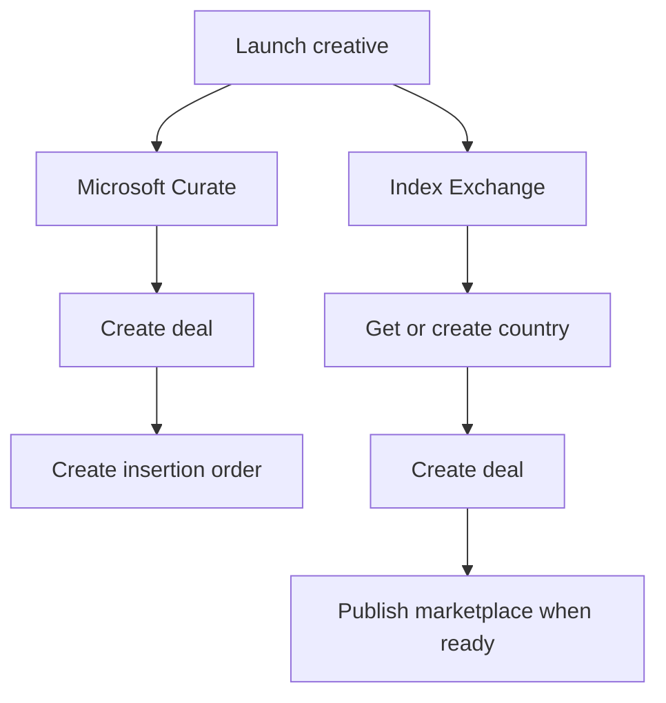

# Provider Brief

This exercise includes two fake external advertising platforms. They are represented in code by in-process clients, but you should think of them as stand-ins for third-party HTTP APIs.

Your task is not to know these platforms already. The important part is understanding that one internal launch workflow may need to call multiple external systems that have different request shapes and different lifecycle behavior.

## What Launch Means

- An operator clicks `Launch` once.
- The system may need to submit that creative to more than one external platform.
- Those platforms do not behave the same way.
- Operators need to understand what happened after launch.

## Platform Summary

### Microsoft Curate

- First create a deal.
- Then create an insertion order for that deal.
- This is the simpler, more synchronous-looking flow in the exercise.

### Index Exchange

- First get or create a country.
- Then create a deal for that country.
- The deal may not be ready immediately.
- When the deal reaches the right state, publish it to marketplace.
- This is the more asynchronous-looking flow in the exercise.

## Simplified Flow Diagram

## What To Keep In Mind

- These are fake provider clients, not internal domain services.
- A single product action can fan out to multiple provider-specific workflows.
- Different providers may succeed, fail, or take different amounts of time.
- A good solution usually needs clear status tracking and operator visibility.